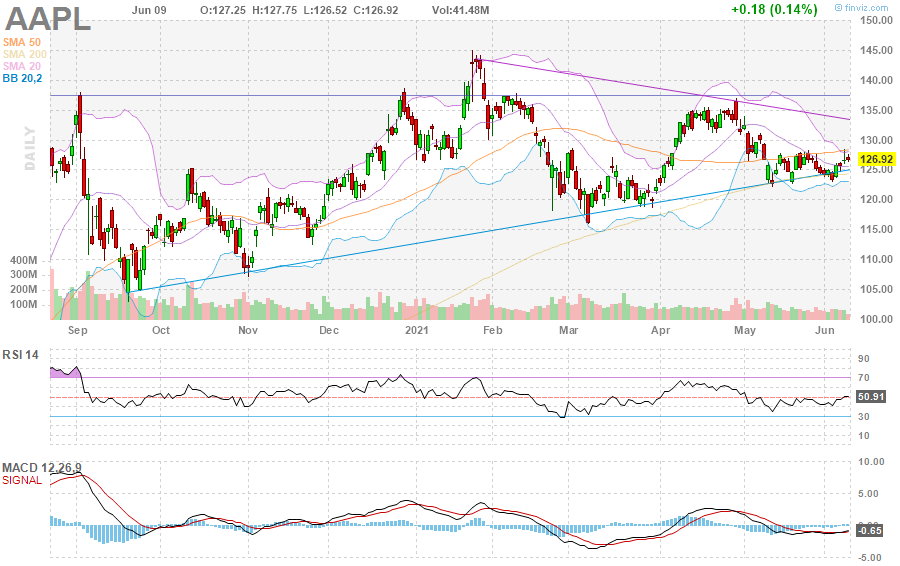

# Algorithmic Trading

### Trading Strategy:
  We are going to only trade stocks listed on the 
  S&P500 for these are safer in relation to consistent volume and are already noticed to be accountable companies, this saves us on overanalyzing and expending our resources.

  - Get all stocks listed on the S&P500
  - Observe the ticker $SPY and see if it is Green or Red(This will tell us if the market is down or up for the day) If $SPY is up for the day this will probably mean that the stocks listed on the S&P500 are green as well and vice versa.
  - Observe the 1 year chart for each company
  - Use indicators such as the RSI value, MACD, SMA50, SMA200, SMA20, BB20,2, upper resistance lines, lower support lines. 
  - When we observe a stock at one of the resistance or support lines we would like to make a trade for movement in stock price will be supported or resisted at the line.  
  - 
  
